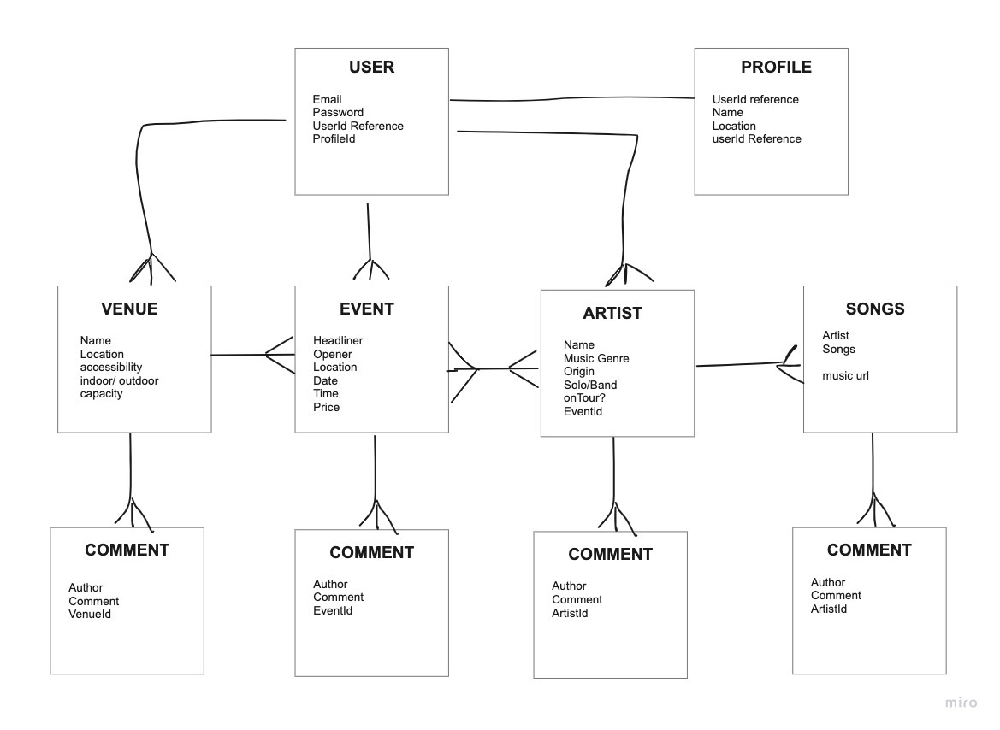

# Team MACK

# Something Musical (SMTHNG MSCL) - project 3 *API*
- Backend Development

## API(s) Used
- Seat Geek API: https://platform.seatgeek.com/#events

## Technologies Used
- JavaScript
- Bearer Token
- Mongoose
- Passport
- Express
- bcrypt

## Installation Instructions
1. 

## ERD
